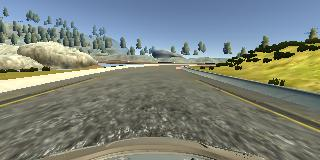

# Behavioral Cloning Project

[](http://www.udacity.com/drive)
---

**Behavioral Cloning Project**

The goals / steps of this project are the following:
* Use the simulator to collect data of good driving behavior
* Build, a convolution neural network in Keras that predicts steering angles from images
* Train and validate the model with a training and validation set
* Test that the model successfully drives around track one without leaving the road
* Summarize the results with a written report


[//]: # (Image References)

[image1]: ./examples/placeholder.png "Model Visualization"
[image2]: ./examples/placeholder.png "Grayscaling"
[image3]: ./examples/placeholder_small.png "Recovery Image"
[image4]: ./examples/placeholder_small.png "Recovery Image"
[image5]: ./examples/placeholder_small.png "Recovery Image"
[image6]: ./examples/placeholder_small.png "Normal Image"
[image7]: ./examples/placeholder_small.png "Flipped Image"

## Rubric Points
### Here I will consider the [rubric points](https://review.udacity.com/#!/rubrics/432/view) individually and describe how I addressed each point in my implementation.  

---
### Files Submitted & Code Quality

#### 1. Submission includes all required files and can be used to run the simulator in autonomous mode

My project includes the following files:
* model.py containing the script to create and train the model
* drive.py for driving the car in autonomous mode
* model2.h5 containing a trained convolution neural network 
* writeup_report.md or writeup_report.pdf summarizing the results

#### 2. Submission includes functional code
Using the Udacity provided simulator and my drive.py file, the car can be driven autonomously around the track by executing 
```sh
python drive.py model2.h5
```

#### 3. Submission code is usable and readable

The model.py file contains the code for training and saving the convolution neural network. The file shows the pipeline I used for training and validating the model, and it contains comments to explain how the code works.

### Model Architecture and Training Strategy

#### 1. An appropriate model architecture has been employed

My model consists of a convolution neural network with 5x5 filter sizes and depths between 24 and 48, and then with 3x3 filter sizes and depth of 64.  

The model includes RELU layers to introduce nonlinearity, and the data is normalized in the model using a Keras lambda layer. 

#### 2. Attempts to reduce overfitting in the model

The model contains dropout layers in order to reduce overfitting, the frop out rate set to be 0.5. 

The model was trained and validated on different data sets to ensure that the model was not overfitting. The model was tested by running it through the simulator and ensuring that the vehicle could stay on the track.

#### 3. Model parameter tuning

The model used an adam optimizer, so the learning rate was not tuned manually.

#### 4. Appropriate training data

Training data was chosen to keep the vehicle driving on the road. I used a center lane driving, and read the data from center, left, and right cameras for the training and validation.

For details about how I created the training data, see the next section. 

### Model Architecture and Training Strategy

#### 1. Solution Design Approach

The overall strategy for deriving a model architecture was to come up with the model that can be used based on a small data set. Overfitting initially and use optimizer tuning the parameters until works well.

My first step was to use a convolution neural network model similar to the the one stated in the lectures. I thought this model might be appropriate because these are solving the same problem.

In order to gauge how well the model was working, I split my image and steering angle data into a training and validation set. I found that my first model had a low mean squared error on the training set but a high mean squared error on the validation set. This implied that the model was overfitting. 

To combat the overfitting, I modified the model with the dropout.

Than I apply the optimizer to tuning the parameters. 

The final step was to run the simulator to see how well the car was driving around track one. There were a few spots where the vehicle fell off the track, especially when the lane line changed. To improve the driving behavior in these cases, I added more data around that part.

At the end of the process, the vehicle is able to drive autonomously around the track without leaving the road.

#### 2. Final Model Architecture

The final model architecture consisted of a convolution neural network with the following layers and here is a visualization of the architecture (note: visualizing the architecture is optional according to the project rubric)


#### 3. Creation of the Training Set & Training Process

To capture good driving behavior, I first use the provided data set for the training. Here is an example image of center lane driving:



I then recorded the vehicle recovering from the left side and right sides of the road back to center so that the vehicle would learn to go back to the center of the lane. These images show what a recovery looks like starting from right side :

 


To augment the data sat, I also flipped images and angles thinking that this would help with the accurancy of training the model. For example, here is an image that has then been flipped:


After the collection process, I had training of the initial saved data points 3 times (24,108). I then preprocessed this data by read using cv2, and convert the format from BGR to RGB.

I finally randomly shuffled the data set and put 20% of the data into a validation set. 

I used this training data for training the model. The validation set helped determine if the model was over or under fitting. The ideal number of epochs was 3 as evidenced by there is little improvement after that. I used an adam optimizer so that manually training the learning rate wasn't necessary.

Finally, I used the taining model to drive the car automatically, then saved the photo taken from middle camera in to folder "drive2", and generated the video based on the recorded frames named drive2.mp4. This video is based on more than 1 round of drive track and it is clear the driving performance is good. 
